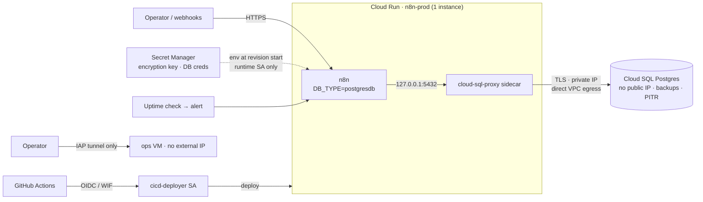

# gcp-landing-zone-n8n

[](https://github.com/henryekeocha/gcp-landing-zone-n8n/actions/workflows/ci.yml) [](https://github.com/henryekeocha/gcp-landing-zone-n8n/actions/workflows/build.yml)

> **Status: complete (validate-only PoC).** Built phase by phase with incremental commits; the history is the changelog. No GCP resources were provisioned; every module is `terraform validate` + `tflint` clean in CI.

A proof-of-concept **GCP landing zone** (multi-project structure, private networking, least-privilege IAM and Secret Manager) hosting a **self-hosted n8n** instance on **Cloud Run**, backed by **Cloud SQL for PostgreSQL** (private IP, automated backups, point-in-time recovery). Everything is expressed as Terraform and validated in CI without touching a real GCP account; the one intentionally manual step (image push + `terraform apply` against a real org/billing account) is documented rather than faked.

## Architecture, by phase

- [x] **Phase 0: Skeleton**: repo structure, license, CI-safe `.gitignore`
- [x] **Phase 1: Projects** (`terraform/projects/`): prod / dev / shared-services project structure
- [x] **Phase 2: Networking** (`terraform/networking/`): per-environment VPC + subnets, IAP-only SSH (no `0.0.0.0/0` ingress), Cloud NAT egress
- [x] **Phase 3: IAM & secrets** (`terraform/iam/`): separate n8n-runtime and CI/CD service accounts, Secret Manager for the n8n encryption key + DB credentials, documented MFA org policy
- [x] **Phase 4: PostgreSQL** (`terraform/database/`): Cloud SQL Postgres, private IP only, backups + PITR, deletion protection, restore runbook
- [x] **Phase 5: n8n on Cloud Run** (`terraform/n8n/`): n8n with `DB_TYPE=postgresdb`, Cloud SQL Auth Proxy sidecar, secrets injected from Secret Manager
- [x] **Phase 6: CI/CD** (`.github/workflows/`): fmt + validate on PR, container build on merge
- [x] **Phase 7: Monitoring** (`terraform/monitoring/`): uptime check + alerting policy on the n8n endpoint
- [x] **Phase 8: Docs**: architecture diagram, consolidated hand-off runbook

## Architecture



Full diagrams (resource hierarchy, data flow, trust boundaries): [`docs/architecture.md`](docs/architecture.md).

## Docs

| Doc | Read it when |
|---|---|
| [`docs/handoff-runbook.md`](docs/handoff-runbook.md) | you are taking this over: setup order, rotation, incident triage |
| [`docs/architecture.md`](docs/architecture.md) | you want the why behind the layout |
| [`docs/postgres-runbook.md`](docs/postgres-runbook.md) | you need to restore Postgres to a point in time |
| [`docs/n8n-operations.md`](docs/n8n-operations.md) | you are deploying, rolling back, or rotating n8n secrets |
| [`docs/org-policy-mfa.md`](docs/org-policy-mfa.md) | someone asks "how is MFA enforced?" |

## Repo layout

```
terraform/
  projects/     # prod / dev / shared-services projects
  networking/   # VPC, subnets, firewall, Cloud NAT
  iam/          # service accounts, Secret Manager, bindings
  database/     # Cloud SQL Postgres
  n8n/          # Cloud Run service + Cloud SQL Auth Proxy sidecar
  monitoring/   # uptime check + alerting
n8n/            # Dockerfile wrapping the pinned official image
docs/           # runbooks, architecture, org-policy notes
scripts/        # CI policy guard (no public SSH)
.github/workflows/  # ci.yml (fmt/validate/lint), build.yml (image build, no push)
```

## Ground rules for this PoC

- No `terraform apply` was run and no real GCP resources exist. Every module is `terraform validate`-, `terraform fmt`- and `tflint`-clean; CI enforces all three plus a guard that fails the build if any firewall rule allows SSH/RDP from `0.0.0.0/0`.
- No GCP credentials are needed to work on this repo.
- The manual bridge to a real environment (auth, image push, apply) is written up in `docs/`, not hidden.

## License

MIT. See [LICENSE](LICENSE).
