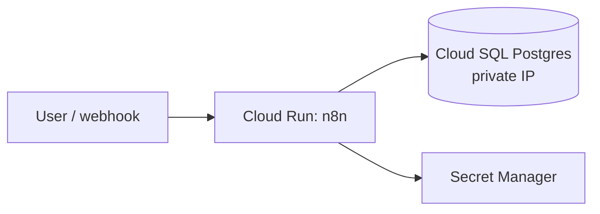

# gcp-landing-zone-n8n

> **Status: in progress — building in public.** This repo is being built phase by phase with visible incremental commits. Check the commit history to see how it evolved.

A proof-of-concept **GCP landing zone** — multi-project structure, private networking, least-privilege IAM and Secret Manager — hosting a **self-hosted n8n** instance on **Cloud Run**, backed by **Cloud SQL for PostgreSQL** (private IP, automated backups, point-in-time recovery). Everything is expressed as Terraform and validated in CI without touching a real GCP account; the one intentionally manual step (image push + `terraform apply` against a real org/billing account) is documented rather than faked.

## Planned architecture

Checked off as each phase lands.

- [x] **Phase 0 — Skeleton**: repo structure, license, CI-safe `.gitignore`
- [x] **Phase 1 — Projects** (`terraform/projects/`): prod / dev / shared-services project structure
- [x] **Phase 2 — Networking** (`terraform/networking/`): per-environment VPC + subnets, IAP-only SSH (no `0.0.0.0/0` ingress), Cloud NAT egress
- [x] **Phase 3 — IAM & secrets** (`terraform/iam/`): separate n8n-runtime and CI/CD service accounts, Secret Manager for the n8n encryption key + DB credentials, documented MFA org policy
- [x] **Phase 4 — PostgreSQL** (`terraform/database/`): Cloud SQL Postgres, private IP only, backups + PITR, deletion protection, restore runbook
- [x] **Phase 5 — n8n on Cloud Run** (`terraform/n8n/`): n8n with `DB_TYPE=postgresdb`, Cloud SQL Auth Proxy sidecar, secrets injected from Secret Manager
- [ ] **Phase 6 — CI/CD** (`.github/workflows/`): fmt + validate on PR, container build on merge
- [ ] **Phase 7 — Monitoring** (`terraform/monitoring/`): uptime check + alerting policy on the n8n endpoint
- [ ] **Phase 8 — Docs**: architecture diagram, consolidated hand-off runbook

## Architecture sketch (placeholder — replaced in Phase 8)



## Repo layout

```
terraform/
  projects/     # prod / dev / shared-services projects
  networking/   # VPC, subnets, firewall, Cloud NAT
  iam/          # service accounts, Secret Manager, bindings
  database/     # Cloud SQL Postgres
  n8n/          # Cloud Run service + Cloud SQL Auth Proxy sidecar
  monitoring/   # uptime check + alerting
docs/           # runbooks, architecture, org-policy notes
.github/workflows/
```

## Ground rules for this PoC

- No `terraform apply` was run and no real GCP resources exist. Every module is `terraform validate`-clean and formatted; CI enforces both.
- No GCP credentials are needed to work on this repo.
- The manual bridge to a real environment (auth, image push, apply) is written up in `docs/`, not hidden.

## License

MIT — see [LICENSE](LICENSE).
