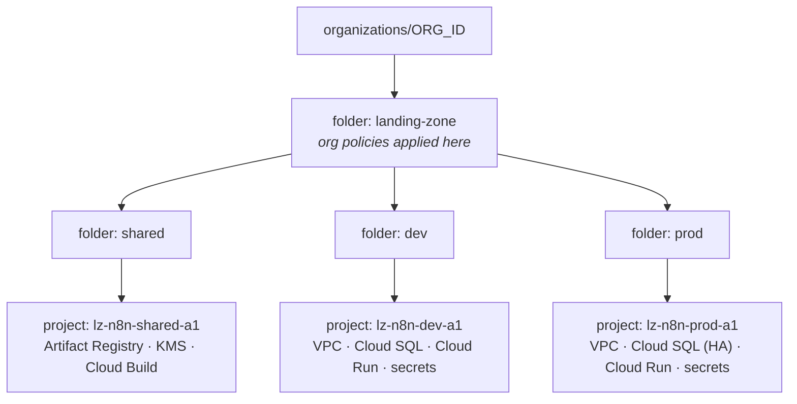
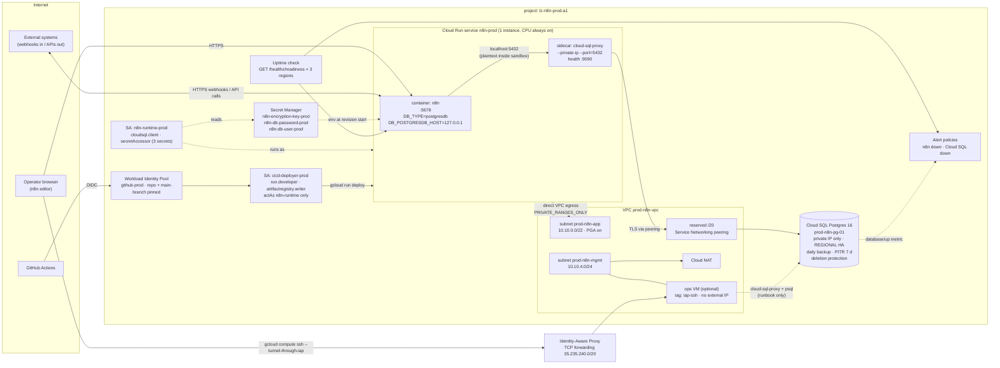

# Architecture

## Resource hierarchy



Terraform: `terraform/projects`. Each workload project then gets one instance
each of `networking`, `iam`, `database`, `n8n`, `monitoring`.

## Runtime data flow (one workload project)



## What sits where, and why

| Concern | Where | Reasoning |
|---|---|---|
| Workflow definitions, credentials (encrypted), execution history | Cloud SQL Postgres | survives revisions; backed up; PITR. SQLite on Cloud Run's ephemeral FS would lose everything on deploy |
| Encryption key for stored credentials | Secret Manager, runtime SA only | the DB backup is useless without it; the deployer must not be able to read it |
| DB password | Secret Manager, written by `terraform/database` | Terraform generates it; n8n reads it; humans never see it |
| DB network path | Auth Proxy sidecar → private IP over VPC peering | TLS + IAM-authenticated connection; no public IP on the instance, ever |
| Cloud Run → VPC | direct VPC egress into `app` subnet | no Serverless VPC connector to size and pay for |
| Human SSH | IAP TCP forwarding only | no `0.0.0.0/0:22` anywhere; identity + 2SV enforced by IAP |
| CI identity | Workload Identity Federation | no service account keys exist to leak |
| Deploy vs run | two service accounts | CI compromise ≠ data compromise |
| Cloud Run scaling | `min = max = 1`, `cpu_idle = false` | n8n regular mode runs triggers in-process; more instances need queue mode |
| Alerting | readiness endpoint, not liveness | readiness includes the DB path |

## Trust boundaries

1. **Internet → Cloud Run**: TLS at Google's front end; n8n's own auth for the editor, per-workflow auth for webhooks. Optional: HTTPS LB + Cloud Armor + IAP when `iam.allowedPolicyMemberDomains` forbids `allUsers` invoker.
2. **Cloud Run → Cloud SQL**: IAM (`cloudsql.client`) + TLS via the proxy; network path is private peering, unreachable from outside the VPC.
3. **Cloud Run → Secret Manager**: per-secret IAM to the runtime SA; resolved once per revision.
4. **GitHub → GCP**: OIDC token exchange, pinned to repository (and `main` for prod); can deploy, cannot read secrets or data.
5. **Human → VMs**: IAP only; `roles/iap.tunnelResourceAccessor` + OS Login.

## Module dependency order

```
projects → networking → iam → database → n8n → monitoring
```

`database` needs `networking` (peering) and `iam` (secret to write the
password into). `n8n` needs all three. `monitoring` needs `n8n`'s hostname and
`database`'s instance name. In a real root module these are `module` blocks
with outputs wired together; here each directory validates standalone with
explicit variables so CI can check every module without credentials.
